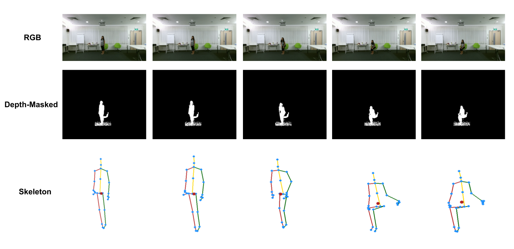
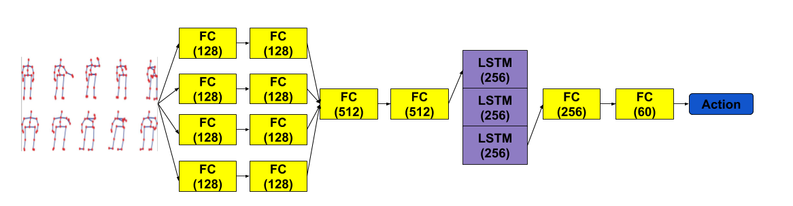
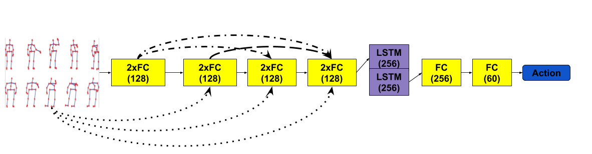
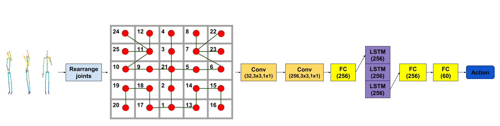
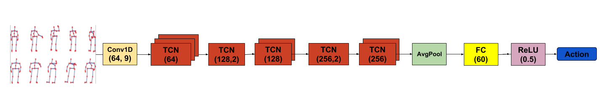

# Low-Latency Human Action Recognition

PyTorch implementation of Skeleton-based Human Action Recognition for the data set NTU RGB+D Action Recognition Dataset ([github page](https://github.com/shahroudy/NTURGB-D/)).



## Description

This repository holds codebase for read and preprocessing steps, training process and several classification models based on artificial neural networks.

## Preprocessing
### Transforms

* ``MoveOriginToJoint`` -- Move origin of skeletons in sequences to the selected (by index) joint. 
* ``NormalizeSkeletonsByFrame`` -- Normalize each skeleton in a sequence using frame-by-frame values.
* ``NormalizeSkeletonsBySequence`` -- Normalize each skeleton in a sequence using the whole sequence.
* ``SelectFirstSkeleton`` -- If multiple skeletons are present in the sequence, select the first one for each frame.
* ``SelectMaxMotionEnergySkeleton`` -- If multiple skeletons are present in the sequence, select the most active one for each frame, based on the distance traveled between two frames.
* ``UniformSampleOrPad`` --  **i)** If *num_frames* is greater than *sample_size*, select *sample_size* frames
    using random uniform generator. **ii)** If *num_frames* is less than *sample_size*, frames are filled with zero-padding. **iii)** If *num_frames* is equals to *sample_size*, return input sequence with new entry (*length*).
* ``UniformSample`` --  Provides the ability to apply the previous transform for a batch.
* ``RearrangeSkeletonJoints`` -- Modify order of the joints in the sequence using sequence of indices. **Obs:** Duplicates are allowed!
* ``ToTensor`` -- Convert a sequence to Tensor.
* ``MovingPoseDescriptor`` -- Adding first derivatives and second derivatives. If normalize is True, then speed is scalar and otherwise is vector.
* ``ResizeSkeletonSegments`` --  Normalize the size of segments between adjacent joints based on values calculated using the the data in the training set.
* ``SmoothingTimeSeries`` -- Smoothing is usually done to help us better see patterns, trends for example, in time series and this transform offers the possibility to apply this operation for various types of windows.
* ``GaussianFilter`` -- Apply a Gaussian filter using a 5-frame window.
* ``MovingPoseDescriptorForBatch`` -- Provides the ability to apply the ``MovingPoseDescriptor`` transform for a batch.

## Architectures
### Linear LSTM
Illustration of the network structure of our first model with **FC** layers andStacked **LSTM** with depth 3. For each layer, the output size is specified.

The performances obtained for the first proposed architecture, namely the one that uses fully connected layers for feature extraction and **LSTM** for sequence analysis, indicate that combining even simple spatial transformations and then sequence analysis, using a recurrent neural network, performs strongly.

### Densely Connected Linear LSTM
Continuing on the idea of just performing simple transformations on the raw 3D skeleton, we have drawn inspiration from the **Densely Connected Convolutional Networks** proposed by Huang et al ([arxiv paper](https://arxiv.org/abs/1608.06993)).


The analysis of the second proposed model, which is a dense one, shows that a too large number of parameters used for spatial transformation actually harms performance.

### Relational LSTM 

### Conv LSTM
Therefore, we need a better strategy for treating skeleton frames before feeding them to recurrent neural networks. We have tried to reduce these inconveniences in our third proposed architecture, which uses joint rearrangement. We propose a way to add structure to the input features, which comes from our desire to fulfill two goals. The first one is to take into account spatial connections between body joints and the second is to take advantage of the capability of convolutional layers to discover patterns in localized regions while managing to abstract over them in subsequent layers. Therefore, we have proposed an arrangement of the 25 3D body joints into a 5 × 5 matrix whose corner regions correspond to body limbs while the center holds information on the head and torso.

Because **CNNs** are analysing areas of interest with reduced size, the 2D joint arrangement aims to facilitate the detection of relationships between different skeleton joint groups (for example, the left hand may be located far away from the right hand). The idea used in this approach is strong, but the additional information provided by the **CNNs** is lost when switching to the treatment of the temporal aspect, in our case when feeding the information through **LSTMs**.



### TCN
Starting from the aspects observed in the previous approaches, in the TCN based architecture we did not separate the data from spatio-temporal perspective, but treated them concurrently, using TCN layers. Also, we have not applied major transformations on the input space, leaving the values arranged as a 1D vector.
Network architecture of the **TCN** model:

For each TCN layer, the number of channelsproduced by the convolution and the stride (if it is different than1) are specified. For this model, we used 1D convolutional layers with kernel_size=9 and stride=2 for units with different size for output andstride=1 for others

## Results
| Architecture 	| Sequence Size 	| Accuracy CS | Accurancy CV |
|--------------	|-------------------|-----------|-------|
| FCs + LSTM | 300 | 72.04% | 79.41%|
| FCs + LSTM | 50 | 72.16% | 80.39% |
|FCs + LSTM + Moving Pose Descriptor | 50 | 73.11% | 79.06% |
| Densley Connected FCs + LSTM | 300 | 70.80% | 78.34% |
| Densley Connected FCs + LSTM | 50 | 68.20% | 74.07% |
| Relational + LSTM | 50 | 65.42% |  67.46% |
| Relational + LSTM + Initial data | 50 | 66.14% | 69.44% |
| 2D Arrangement CNN + LSTM + Initial data | 50 | 71.48% | 77.11% |
| 2D Arrangement CNN + LSTM | 50 | 71.62% | 79.18% |
| 2D Arrangement CNN + LSTM + Initial data | 300 | 73.85% | 77.31%|
| 2D Arrangement CNN + LSTM | 300 | 74.19% | 76.89% |
| Graph Conv + LSTM  | 50 | 63.00% |  62.87%| 
| TCNs | 50 |  77.30% | 82.47% |

## Instalation and Use

### Requirements
```
python
numpy
pytorch
yaml
tensorboardX
zipfile
sklearn
torchvision
termcolor
skimage
json
```
### Config file
```yaml
batch_size: 32
epochs: 200
sample_size: 300
maximum_sample_size: 300
seed: 120
log_interval: 1
checkpoint_interval: 5
hidden_dim: 256

train_path: /home/aimas/workspace/mihai/dataset/skeleton/train_cross_subject
test_path: /home/aimas/workspace/mihai/dataset/skeleton/test_cross_subject
cache_path: /home/aimas/workspace/mihai/kinect-activity-recognition-tests/skeleton-cache

selected_actions: null
selected_joints: null

use_cache: True
plot_name: loss_plot.svg

use_validation: True
validation_fraction: 0.1
use_sampling: True

preprocessing_threads: 16
joint_size: 9

model: models.tcnLSTM.TCNModel
model_args:
  channel: 441
  num_class: 60
  no_of_joints: 25
  use_data_bn: True
  joint_size: 9

optimizer: Adam
optimizer_args:
  learning_rate: 0.001

loss: torch.nn.CrossEntropyLoss
```

### Demo
```
CUDA_VISIBLE_DEVICES=0 python main.py
```

## Contact
For any question, feel free to contact us.
```
Mihai Trăscău - mihai.trascau@gmail.com
Mihai Nan - mihai.nan.cti@gmail.com
```
